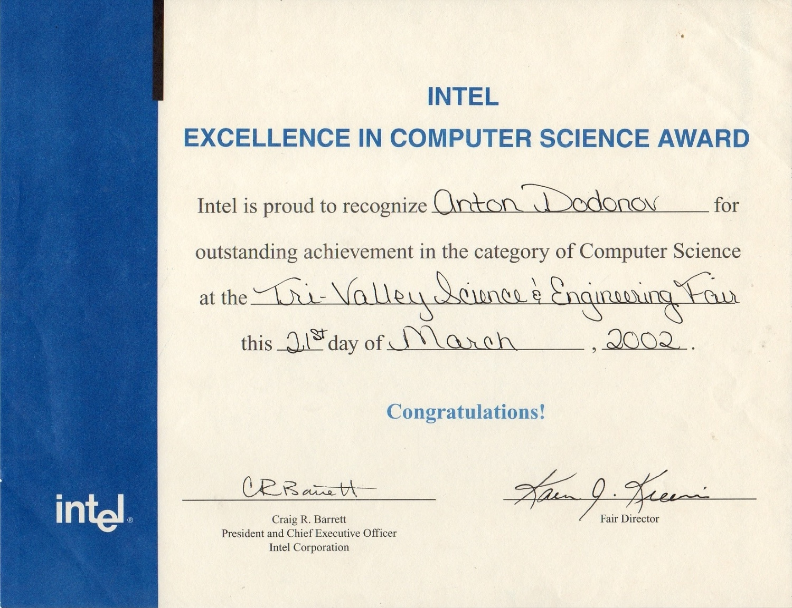
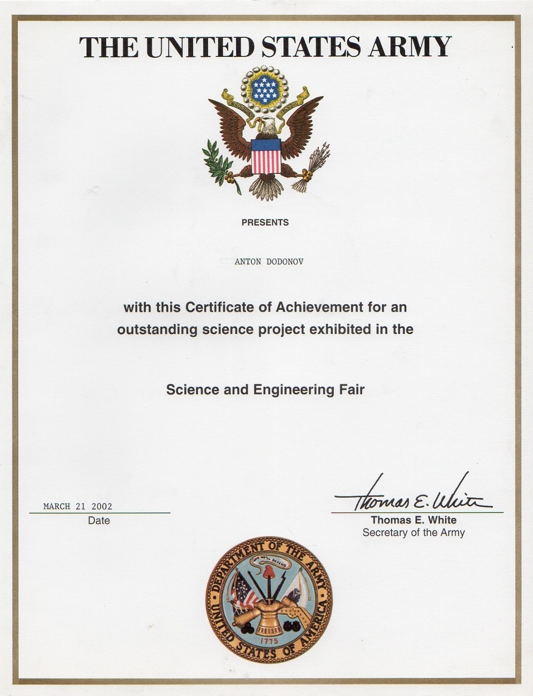

  <h1>👋 Hi there, I'm Anton</h1>
  <h3>🚀 CTO with 20+ years of Commercial Development Experience</h3>

### 🌟 **About Me**
- 🧠 **Founder**: [VPN Client](https://github.com/VPNclient), [Braindler](https://github.com/Braindler)
- 🤝 **Co-Founder**: [Dilap](https://xn--80ahmmv.xn--p1ai/proekt.html)
- 🗣️ **Languages**: Fluent in **Russian** and **English**, currently learning **Thai**.  
- 📍 **Current Location**: Chiang Mai, Thailand.
- 💻 **Development Experience**:  
  - Started coding **33 years ago** on a Spectrum 48Kb.  
  - First time, won **1st place** at an IT hackathon **29 years ago** (Intel 286 SX).  
  - Earned Intel and US Army diplomas at a Computer Science Fair **22 years ago** (Livermore, California). 
    
### 🏆 **My Team**
-  My Business is [NativeMind](https://github.com/NativeMindNet), team of developers, a tight-knit professional family, was started **17 years ago**.

### 💬 **How to Reach Me**
- 📫 Feel free to connect or reach out: &nbsp;   

### 🏅 Diplomas

